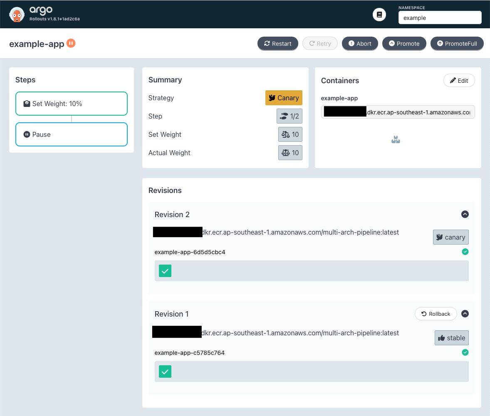

# AWS CDK Stacks

This repository contains stacks for various solutions in AWS. These stacks are used for Proof-of-Concept (POC) and demonstration.

## ❗ Warning ❗

- **Review and change the configurations before using it for production**: the current configuration should not be used for production without further review and adaptation.

- **Be mindful of the costs incurred**: while this solution is developed to be cost-effective, please be mindful of the costs incurred.

# Table of Content

- [Initial Setup](#initial-setup)
- [Multi-Architecture Pipeline](#multi-architecture-pipeline)
- [Elastic Container Service (ECS)](#elastic-container-service-ecs)
  - [ECS Cluster Setup](#ecs-cluster-setup)
  - [CICD Pipeline for ECS Cluster](#cicd-pipeline-for-ecs-cluster)
- [Elastic Kubernetes Service (EKS)](#elastic-kubernetes-service-eks)
  - [EKS Cluster](#eks-cluster)
  - [Add-Ons](#add-ons)
  - [Deploy Application](#deploy-application)
  - [Metrics Server and Horizontal Pod Autoscaler (HPA)](#metrics-server-and-horizontal-pod-autoscaler-hpa)
  - [Argo CD](#argo-cd)
  - [Argo Rollouts](#argo-rollouts)
  - [Amazon VPC Lattice](#amazon-vpc-lattice)
  - [Distributed ML with Ray](#distributed-ml-with-ray)
  - [Model Inference](#model-inference)
  - [Jenkins on AWS](#jenkins-on-aws)
- [API Gateway and Lambda](#api-gateway-and-lambda)
- [Egress VPC](#egress-vpc)

# Initial Setup

1. Install npm packages with `npm install`.

2. Configure AWS CLI in order to bootstrap your AWS account for the CDK. Replace `{{...}}` with actual values.

```bash
aws configure set aws_access_key_id {{ACCESS_KEY_ID}}
aws configure set aws_secret_access_key {{SECRET_ACCESS_KEY}}
aws configure set region {{REGION, e.g. ap-southeast-1}}
aws configure set output json
```

3. Bootstrap AWS account for CDK with `cdk bootstrap`.

4. Create an EC2 Key Pair named "EC2DefaultKeyPair" (leave other settings as default) in the [EC2 console](https://console.aws.amazon.com/ec2/home#KeyPairs:).

5. Rename 'example.env' to '.env' and fill up all the values.

6. Create a connection in [Developer Tools](https://console.aws.amazon.com/codesuite/settings/connections) (ensure that you are creating in your ideal region). Copy the ARN of the connection to your `.env` file. This is required for solutions like Multi-Architecture Pipeline.

# Multi-Architecture Pipeline

```bash
cdk deploy multi-arch-pipeline
```

The pipeline will create Docker images for amd64 and arm64 architectures and store them in an Elastic Container Registry (ECR) repository. A Docker manifest will also be created and uploaded to the registry so that the Docker images for the respective architectures can be retrieved automatically with the 'latest' tag.

# Elastic Container Service (ECS)

> Prerequisite: [Multi-Architecture Pipeline](#multi-architecture-pipeline)

## ECS Cluster

```bash
cdk deploy ecs
```

Creates a new ECS cluster. The ECS cluster has an ECS service that uses Fargate for compute resources. An Application Load Balancer (ALB) will be created to expose the ECS service. The cluster also has an EC2 Auto-Scaling Group (ASG) as the capacity provider that scales on 70% CPU utilization. A CloudWatch dashboard will be created to visualize the CPU utilization of both services.

## ECS Cluster with CICD Pipeline

```bash
cdk deploy ecs-cicd
```

Creates a new CodePipeline, ECR repository, and S3 bucket to build and deploy a container image to the ECS cluster.

# Elastic Kubernetes Service (EKS)

> Prerequisite: [Multi-Architecture Pipeline](#multi-architecture-pipeline)

## EKS Cluster

### 1. Provision an EKS cluster with one of these commands:

```bash
# Deploy a cluster
cdk deploy eks
```

These resources will be created:

- A VPC with public and private subnets and a NAT gateway
- An EKS cluster with 1 managed node group
- A bastion host to manage the EKS cluster
- The necessary IAM roles and policies

### 2. Access the bastion host

Access the bastion host with 'ec2-user' using SSH or EC2 Instance Connect.

> ❗ The commands listed in the EKS sections should be executed in the bastion host. Some environment variables (e.g. AWS_REGION, AWS_ACCOUNT_ID, AWS_EKS_CLUSTER) are already populated in the bastion host.

### 3. Configure the AWS CLI and execute a script to setup the bastion host. Replace `{{...}}` with actual values.

```bash
aws configure set aws_access_key_id {{ACCESS_KEY_ID}}
aws configure set aws_secret_access_key {{SECRET_ACCESS_KEY}}

./setup-bastion-host.sh
```

Region is set by 'setup-bastion-host.sh' automatically in the bastion host.

### 4. Test the connectivity to the EKS cluster with any `kubectl` commands.

```bash
kubectl get svc
```

## Add-Ons

Install add-ons with `-i` argument or remove add-ons with `-r` argument. Both ID and alias of the add-ons can be used.

### Supported Add-Ons

Run the following command to see the list of add-ons.

```bash
./eks-add-ons.sh
```

### Example #1: Install Karpenter

```bash
./eks-add-ons.sh -i karpenter
# OR
./eks-add-ons.sh -i 1
```

### Example #2: Install multiple add-ons

```bash
./eks-add-ons.sh -i "karpenter load-balancer-controller"
# OR
./eks-add-ons.sh -i "1 2"
```

### Example #3: Remove multiple add-ons

```bash
./eks-add-ons.sh -r "karpenter load-balancer-controller"
# OR
./eks-add-ons.sh -r "1 2"
```

## Deploy Application

> Prerequisite 1: Deploy the Multi-Architecture Pipeline. To use your own container image from a registry, replace \<URL\> and execute `export CONTAINER_IMAGE_URL=<URL>`.

> Prerequisite 2: Install [AWS Load Balancer Controller](#add-ons).

### Setup

1. Deploy the application with one of the following options

```bash
curl https://raw.githubusercontent.com/tchangkiat/aws-cdk-stacks/main/assets/web-app.yaml -o web-app.yaml

sed -i "s|\[URL\]|${CONTAINER_IMAGE_URL}|g" web-app.yaml

kubectl apply -f web-app.yaml
```

### Clean Up

1. Remove the application.

```bash
kubectl delete -f web-app.yaml

rm web-app.yaml
```

## Metrics Server and Horizontal Pod Autoscaler (HPA)

### Setup

1. Deploy the Metrics Server:

```bash
kubectl apply -f https://github.com/kubernetes-sigs/metrics-server/releases/latest/download/components.yaml
```

2. The above deployment may take minutes to complete. Check the status with this command:

```bash
kubectl get apiservice v1beta1.metrics.k8s.io -o json | jq '.status'
```

3. Assuming that the application was deployed, execute the following command to configure HPA for the deployment:

```bash
kubectl autoscale deployment web-app -n example \
    --cpu-percent=50 \
    --min=1 \
    --max=10
```

4. Check the details of HPA.

```bash
kubectl get hpa -n example
```

### Clean Up

1. Remove the HPA and Metrics Server.

```bash
kubectl delete hpa web-app -n example

kubectl delete -f https://github.com/kubernetes-sigs/metrics-server/releases/latest/download/components.yaml
```

## Argo CD

### Setup

1. Install pre-requisites if they are not installed yet.

```bash
./eks-add-ons.sh -i "karpenter load-balancer-controller"
```

2. Setup Argo CD and install Argo CD CLI.

```bash
./eks-add-ons.sh -i argo-cd
```

3. Create an application in Argo CD and link it to the repository. Nginx is used as an example below.

```bash
export EKS_CLUSTER_ARN=`kubectl config view -o jsonpath='{.current-context}'`
export ARGOCD_CLUSTER_URL=`argocd cluster list | grep $EKS_CLUSTER_ARN | awk '{print $1}'`
kubectl create namespace nginx
argocd app create nginx --repo https://github.com/tchangkiat/aws-cdk-stacks.git --path assets/argocd --dest-server $ARGOCD_CLUSTER_URL --dest-namespace nginx
```

4. Sync the application in Argo CD to deploy Nginx.

```bash
argocd app sync nginx
```

5. Get the load balancer's CNAME to access Nginx.

```bash
kubectl get svc -n nginx | awk '{print $4}'
```

### Clean Up

1. Remove Nginx application from Argo CD

```bash
argocd app delete nginx -y
kubectl delete ns nginx
```

2. Remove Argo CD.

```bash
./eks-add-ons.sh -r argo-cd
```

3. Remove pre-requisites.

```bash
./eks-add-ons.sh -r "karpenter load-balancer-controller"
```

## Argo Rollouts

### Setup

1. Install pre-requisites if they are not installed yet.

```bash
./eks-add-ons.sh -i "karpenter load-balancer-controller"
```

2. Install Argo Rollouts and an example for canary deployment.

```bash
./eks-add-ons.sh -i "argo-rollouts"
```

3. [Perform on your local machine] Install Argo Rollouts Kubectl Plugin. Ensure that you have connection to your Amazon EKS cluster and run `kubectl argo rollouts dashboard` in a terminal. Access the dashboard using a browser: `localhost:3100`.

### Canary Deployment Demo

1. Edit the `example-app` deployment with `kubectl edit deployment example-app -n example` and amend the `nodeSelector` section:

```bash
...
nodeSelector:
  karpenter.k8s.aws/instance-family: c7g
  karpenter.sh/nodepool: graviton
...
```

2. The `example-app` in Argo Rollouts will be in a pause state, with 90% of the traffic routed to the Intel-based instance and 10% of the traffic routed to the Graviton-based instance (verify by accessing the Application Load Balancer).



3. Click `Promote` in Argo Rollouts dashboard to complete the canary deployment and route all the traffic to the Graviton-based instance.

### Clean Up

1. Remove Argo Rollouts.

```bash
./eks-add-ons.sh -r "argo-rollouts"
```

2. Remove pre-requisites.

```bash
./eks-add-ons.sh -r "karpenter load-balancer-controller"
```

## Amazon VPC Lattice

> Prerequisite 1: Deploy the Multi-Architecture Pipeline. To use your own container image from a registry, replace \<URL\> and execute `export CONTAINER_IMAGE_URL=<URL>`.

> Prerequisite 2: Install [AWS Load Balancer Controller](#add-ons).

> Prerequisite 3: Install [Deploy Application](#deploy-application).

### Setup

```bash
./eks-add-ons.sh -i gateway-api-controller
```

### Clean Up

```bash
./eks-add-ons.sh -r gateway-api-controller
```

## Distributed ML with Ray

### Setup

1. Install the pre-requisites if they are not installed yet.

```bash
./eks-add-ons.sh -i "karpenter load-balancer-controller ebs-csi-driver"
```

2. Install JupyterHub and Ray

```bash
./eks-add-ons.sh -i "jupyterhub ray"
```

3. Once all the Pods are 'running', run the following command in the terminal on your client machine. Access JupyterHub using `http://localhost:8080` and Ray Dashboard using `http://localhost:8265`. JupyterHub may take a few minutes to initialize after installing. During this time, you will notice a blank page and a loading animation in your browser when you access the URL.

```bash
# Change the compute type accordingly: x86, gpu, gvt
export rayClusterHeadSvc="x86"

kubectl port-forward --namespace=jupyter service/proxy-public 8080:http & \
kubectl port-forward --address 0.0.0.0 service/raycluster-${rayClusterHeadSvc}-head-svc 8265:8265 &
```

4. Use the username and password found in the terminal (example below) to log in to JupyterHub.

```bash
JupyterHub Username: user1 / admin1
JupyterHub Password: <generated password>
```

5. Once you accessed JupyterHub, you can upload and use the example notebook from `/assets/ray/pytorch-ray-example.ipynb`.

### Clean Up

1. Remove JupyterHub and Ray.

```bash
./eks-add-ons.sh -r "jupyterhub ray"
```

2. Remove pre-requisites.

```bash
./eks-add-ons.sh -r "karpenter load-balancer-controller ebs-csi-driver"
```

## Model Inference

> Prerequisite 1: [Karpenter](#add-ons)
> Prerequisite 2: [AWS EBS CSI Driver](#add-ons)

### Setup

1. [Generate a User Access Token](https://huggingface.co/docs/hub/en/security-tokens) from Hugging Face. Once the container image in step 2 is built, run the following script to set up the node pool, node class, PVC, and secret.

```bash
export HF_TOKEN="<Hugging Face Token>"

curl -o install-vllm.sh "https://raw.githubusercontent.com/tchangkiat/aws-cdk-stacks/main/scripts/eks/install-vllm.sh"
chmod +x install-vllm.sh
./install-vllm.sh
```

2. Deploy a vLLM server with [meta-llama/Llama-3.2-1B-Instruct](https://huggingface.co/meta-llama/Llama-3.2-1B-Instruct).

```bash
curl -o install-vllm-meta-llama.sh "https://raw.githubusercontent.com/tchangkiat/aws-cdk-stacks/main/scripts/eks/install-vllm-meta-llama.sh"
chmod +x install-vllm-meta-llama.sh
./install-vllm-meta-llama.sh
```

3. Wait for the `vllm-meta-llama-server-*` Pod in the `default` namespace to be ready (~11 minutes).

4. Open a terminal window and port forward to the `vllm-meta-llama-server` service.

```bash
kubectl port-forward service/vllm-meta-llama-server 8000:8000
```

5. Open another terminal window and run the following command to perform an inference.

```bash
curl "http://localhost:8000/v1/chat/completions" \
	-w '\n* Response time: %{time_total}s\n' \
	-H "Content-Type: application/json" \
	--data '{
		"model": "meta-llama/Llama-3.2-1B-Instruct",
		"messages": [
			{
				"role": "user",
				"content": "Explain what is Amazon EKS in 3 sentences"
			}
		]
	}'
```

**Sample Result (partial)**

```json
{
  "model": "meta-llama/Llama-3.2-1B-Instruct",
  "choices": [
    {
      "message": {
        "content": "Amazon Elastic Kubernetes Service (EKS) is a managed Kubernetes service provided by Amazon Web Services (AWS) that allows users to create, manage, and scale Kubernetes clusters on AWS. EKS provides a fully managed experience, including cluster creation, patching, and scaling, as well as support for multiple Kubernetes versions and distributions. With EKS, users can focus on deploying and managing their applications, rather than managing the underlying Kubernetes infrastructure."
      }
    }
  ]
}
```

### Clean Up

1. Remove vLLM.

```bash
curl -o remove-vllm-meta-llama.sh "https://raw.githubusercontent.com/tchangkiat/aws-cdk-stacks/main/scripts/eks/remove-vllm-meta-llama.sh"
chmod +x remove-vllm-meta-llama.sh
./remove-vllm-meta-llama.sh

curl -o remove-vllm.sh "https://raw.githubusercontent.com/tchangkiat/aws-cdk-stacks/main/scripts/eks/remove-vllm.sh"
chmod +x remove-vllm.sh
./remove-vllm.sh
```

2. Remove the scripts.

```bash
rm install-vllm-meta-llama.sh
rm install-vllm.sh
rm remove-vllm-meta-llama.sh
rm remove-vllm.sh
```

# Jenkins on AWS

1. Provision an EC2 instance and install Jenkins.

```bash
cdk deploy jenkins
```

2. [Wait until the Jenkins main instance is initialized] Retrieve the initial Jenkins administrator password with this command on your client machine: `ssh -i <key-filename>.pem -o ProxyCommand='ssh -i <key-filename>.pem -W %h:%p ec2-user@<proxy-instance-public-ip>' -i <key-filename>.pem ec2-user@<jenkins-main-instance-private-ip> 'sudo cat /var/lib/jenkins/secrets/initialAdminPassword'`

3. Proxy to the main Jenkins instance on your client machine: `ssh -i <key-filename>.pem -L 8080:<jenkins-main-instance-private-ip>:8080 ec2-user@<proxy-instance-public-ip>`

4. Access Jenkins using `http://localhost:8080/`

5. Follow the instructions in the "Configuring Jenkins" section of [the documentation](https://www.jenkins.io/doc/tutorials/tutorial-for-installing-jenkins-on-AWS/#configuring-jenkins) to complete the setup.

6. When configuring a new Cloud, add 2 AMIs for amd64 and arm64 respectively. Here are the values to fill up for selected parameters (leave the rest as default).
   - **Description**: amd64 / arm64
   - **AMI ID**: (retrieve from EC2 console)
   - **Instance Type**: m5.large / m6g.large
   - **Availability Zone**: ap-southeast-1a (or other AZ)
   - **Security group names**: default (or other security group; need to allow port 22 for Jenkins to communicate with its agents)
   - **Remote FS root**: /var/jenkins
   - **Remote user**: ec2-user
   - **AMI Type**: unix
   - **Labels**: amd64 / arm64
   - **Usage**: Only build jobs with label expressions matching this node
   - **Idle termination time**: 10 (in minutes)
   - **Init script**:
     ```bash
     sudo yum update -y
     sudo yum install -y java-17-amazon-corretto git docker
     sudo mkdir -p /var/jenkins
     sudo chown ec2-user:ec2-user /var/jenkins
     sudo chmod 755 /var/jenkins
     sudo systemctl start docker
     sudo systemctl enable docker
     sudo usermod -a -G docker ec2-user
     ```
   - **Advanced > Number of Executors**: 2
   - **Advanced > Subnet IDs for VPC**: (subnet ID of the VPC that you want the instances to be placed in. The Jenkins instance and agents should be placed in the same subnets)
   - **Advanced > Tags**: (add a tag with key "Name" and value "jenkins/amd64-runner" or "jenkins/arm64-runner" for easy identification)
   - **Advanced > Minimum number of instances**: 0
   - **Advanced > Minimum number of spare instances**: 0

7. Set up a Jenkins pipeline by using the script in [assets/Jenkinsfile](assets/Jenkinsfile).

# API Gateway and Lambda

Deploy a REST API in API Gateway with Lambda Integration and Authorizer.

### Setup

1. Build the zip file for Lambda deployment.

```bash
sh assets/api-gateway/lambda-zip.sh
```

2. Uncomment the stack in [aws-cdk-stacks.ts](./bin/aws-cdk-stacks.ts).

```typescript
// new ApiGateway(app, "api-gateway", {
//   stackName: prefix + "api-gateway",
//   description: "Deploys an API Gateway with a Lambda authorizer",
// });
```

3. Deploy the stack.

```bash
cdk deploy api-gateway
```

### Testing the API resources

```bash
# Replace '<...>' with the respective values

# Get a JWT token
curl https://<API ID>.execute-api.ap-southeast-1.amazonaws.com/v1/auth

# Verify
curl -H "Authorization: <JWT token retrieved from the previous command>" https://<API ID>.execute-api.ap-southeast-1.amazonaws.com/v1
```

### Clean Up

1. Destroy the stack.

```bash
cdk destroy api-gateway
```

# Egress VPC


```bash
cdk deploy egress-vpc
```

Deploy an egress VPC with Transit Gateway. VPN-related resources are deployed for the VPN connection between the Transit Gateway and the simulated customer's on-prem environment.

## Establish VPN connection from the Transit Gateway to a simulated customer on-prem environment

1. Follow section 4 and 5 in the following article to deploy an EC2 instance with strongSwan to establish a Site-to-Site VPN -> [Simulating Site-to-Site VPN Customer Gateways Using strongSwan](https://aws.amazon.com/blogs/networking-and-content-delivery/simulating-site-to-site-vpn-customer-gateways-strongswan/).<br/><br/> Below are the values to fill up some of the parameters of the CloudFormation template used in the article above (for the other parameters, follow the instructions in the section 5 of the article):
   - Stack Name: `egress-vpc-vpn`

   - Name of secret in AWS Secrets Manager for VPN Tunnel 1 Pre-Shared Key: `egress-vpc-psk1`
   - Name of secret in AWS Secrets Manager for VPN Tunnel 2 Pre-Shared Key: `egress-vpc-psk2`
   - VPC ID: select `egress-vpc-customer-vpc`
   - VPC CIDR Block: `30.0.0.0/16`
   - Subnet ID for VPN Gateway: select `egress-vpc-customer-vpc/PublicSubnet1`
   - Elastic IP Address Allocation ID: can be found in the output of the CDK stack. The value should start with `eipalloc-`

> ❗ Wait until the VPN Gateway (EC2 Instance) is created and verify that both IPSec tunnels are 'UP' (Site-to-Site VPN Connections > egress-vpc-vpn > Tunnel details), before proceeding to step 4 and 5. This will take a few minutes.

2. Add a route to `20.0.0.0/16` in the route table (Target: Instance > infra-vpngw-test) of `egress-vpc-customer-vpc/PrivateSubnet1` in order to route requests from instances in `egress-vpc-customer-vpc/PrivateSubnet1` to instances in `egress-vpc-vpc-1/PrivateSubnet1`.

3. Create a Transit Gateway Association and Propagation in the Transit Gateway Route Table for the VPN Transit Gateway attachment. Once you completed this step successfully, you should see a route `30.0.0.0/16` propagated in the Transit Gateway Route Table. Note: this step cannot be automated because there is no way to retrieve the VPN Transit Gateway attachment and then create an association and propagation programmatically.

> ❗ The connection between `egress-vpc-vpc-1` and `egress-vpc-customer-vpc` will be established in a few minutes after completing step 3.

## Testing the network connectivity

1. Connect to `egress-vpc-demo-instance` and `egress-vpc-demo-instance-2` using Session Manager. If you encounter the error `Unable to start command: failed to start pty since RunAs user ssm-user does not exist`, ensure that the `Run As` configuration in Session Manager > Preferences is `ec2-user`.

2. Use `ifconfig` in the instances to retrieve the private IP addresses

3. Ping each other using the private IP addresses - e.g. `ping 30.0.1.30` in `egress-vpc-demo-instance`. You should receive similar results as shown below:

- `egress-vpc-demo-instance`: 64 bytes from 30.0.1.30: icmp_seq=1 ttl=253 time=2.49 ms
- `egress-vpc-demo-instance-2`: 64 bytes from 20.0.0.20: icmp_seq=1 ttl=252 time=3.52 ms

4. Ping a domain (e.g. amazon.com) in one of these instances. You should observe similar results as shown above.

## Clean Up

1. Delete `egress-vpc-vpn` and `egress-vpc` CloudFormation stacks.
