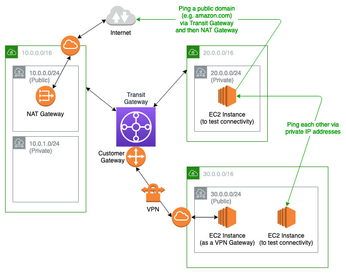

# AWS CDK Stacks

This repository contains stacks for various solutions in AWS. These stacks are used for Proof-of-Concept (POC) and demonstration.

> ❗ These stacks are not suitable for production - necessary modifications should be made if you are using it for production. E.g. enable encryption, switch from burst to standard EC2 family, increase EBS capacity and EKS nodes, etc.

> ❗ You need to be aware of the resources created for each stack and the costs associated with these resources.

# Table of Content

- [Initial Setup](#initial-setup)
- [Standard VPC](#standard-vpc)
- [Transit Gateway](#transit-gateway)
- [Multi-Architecture Pipeline](#multi-architecture-pipeline)
- [Elastic Container Service (ECS)](#elastic-container-service-ecs)
- [Elastic Kubernetes Service (EKS)](#elastic-kubernetes-service-eks)
  - [Bastion Host](#bastion-host)
  - [Add-Ons](#add-ons)
  - [Sample Application](#sample-application)
  - [Metrics Server and Horizontal Pod Autoscaler (HPA)](#metrics-server-and-horizontal-pod-autoscaler-hpa)
  - [Argo CD](#argo-cd)
  - [AWS App Mesh](#aws-app-mesh)
  - [Dask + Jupyter on EKS](#dask--jupyter-on-eks)
  - [Amazon VPC Lattice](#amazon-vpc-lattice)
- [Jenkins on AWS](#jenkins-on-aws)

# Initial Setup

1. Install npm packages with `npm install`.

2. Rename 'sample.env' to '.env' and fill up all the values.

3. Configure AWS CLI in order to bootstrap your AWS account for the CDK.

```bash
aws configure set aws_access_key_id {{ACCESS_KEY_ID}}
aws configure set aws_secret_access_key {{SECRET_ACCESS_KEY}}
aws configure set region {{REGION, e.g. ap-southeast-1}}
aws configure set output json
```

4. Bootstrap AWS account for CDK with `cdk bootstrap`.

# Standard VPC

```bash
cdk deploy vpc
```

Deploy a VPC with a maximum of 3 public and 3 private subnets. A NAT gateway will also be provisioned in one of the public subnets.

# Transit Gateway



```bash
cdk deploy transit-gateway
```

Deploy an egress VPC solution with Transit Gateway. VPN-related resources are deployed for the VPN connection between the Transit Gateway and the simulated customer's on-prem environment. Comment away the code in the section `VPN` of `TransitGateway.js` if the VPN connection is not required.

## Establish VPN connection from the Transit Gateway to a simulated customer on-prem environment

1. Create 2 secrets in AWS Secrets Manager: `tgw-poc-psk1` and `tgw-poc-psk2`. Plaintext values of the respective secrets should be `{"psk":"tgw.poc.psk1"}` and `{"psk":"tgw.poc.psk2"}`.

2. Un-comment the code in the section `VPN` of `TransitGateway.js`.

3. Follow section 4 and 5 in the following article to deploy an EC2 instance with strongSwan to establish a Site-to-Site VPN -> [Simulating Site-to-Site VPN Customer Gateways Using strongSwan](https://aws.amazon.com/blogs/networking-and-content-delivery/simulating-site-to-site-vpn-customer-gateways-strongswan/).<br/><br/> Below are the values to fill up some of the parameters of the CloudFormation template used in the article above (for the other parameters, follow the instructions in the section 5 of the article):

   - Name of secret in AWS Secrets Manager for VPN Tunnel 1 Pre-Shared Key: `tgw-poc-psk1`
   - Name of secret in AWS Secrets Manager for VPN Tunnel 2 Pre-Shared Key: `tgw-poc-psk2`
   - VPC ID: select `tgw-poc-customer-vpc`
   - VPC CIDR Block: `30.0.0.0/16`
   - Subnet ID for VPN Gateway: select `tgw-poc-customer-vpc/PublicSubnet1`
   - Elastic IP Address Allocation ID: can be found in the output of the CDK stack. The value should start with `eipalloc-`

> ❗ Wait until the VPN Gateway (EC2 Instance) is created and verify that both IPSec tunnels are 'UP' (Site-to-Site VPN Connections > tgw-poc-vpn > Tunnel details), before proceeding to step 4 and 5. This will take a few minutes.

4. Add a route to `20.0.0.0/16` in the route table (Target: Instance > infra-vpngw-test) of `tgw-poc-customer-vpc/PrivateSubnet1` in order to route requests from instances in `tgw-poc-customer-vpc/PrivateSubnet1` to instances in `tgw-poc-vpc-1/PrivateSubnet1`.

5. Create a Transit Gateway Association and Propagation in the Transit Gateway Route Table for the VPN Transit Gateway attachment. Once you completed this step successfully, you should see a route `30.0.0.0/16` propagated in the Transit Gateway Route Table. Note: this step cannot be automated because there is no way to retrieve the VPN Transit Gateway attachment and then create an association and propagation programmatically.

> ❗ The connection between `tgw-poc-vpc-1` and `tgw-poc-customer-vpc` will be established in a few minutes after completing step 5.

## Testing the network connectivity

1. Connect to `tgw-poc-demo-instance` and `tgw-poc-demo-instance-2` using Session Manager

2. Use `ifconfig` in the instances to retrieve the private IP addresses

3. Ping each other using the private IP addresses - e.g. `ping 30.0.1.30` in `tgw-poc-demo-instance`

4. You should receive similar results as those below:

- `tgw-poc-demo-instance`: 64 bytes from 30.0.1.30: icmp_seq=1 ttl=253 time=2.49 ms
- `tgw-poc-demo-instance-2`: 64 bytes from 20.0.0.20: icmp_seq=1 ttl=252 time=3.52 ms

# Multi-Architecture Pipeline

```bash
cdk deploy mapl
```

The pipeline will build Docker images for x86 and ARM64 architectures and store them in Elastic Container Registry (ECR). A Docker manifest will also be built and uploaded to the registry so that the Docker images for the respective architectures can be retrieved automatically with the 'latest' tag.

# Elastic Container Service (ECS)

```bash
cdk deploy ecs
```

A new VPC with a NAT gateway and a new ECS cluster will be created. The ECS cluster contains an active and passive EC2 Auto-Scaling Groups (ASGs) which scale on 70% CPU utilization. An Application Load Balancer (ALB) will be used to balance traffic to the ASGs via an ECS service. A similar workload will also be created using Fargate. A CloudWatch dashboard will be created to visualize both workloads (EC2 and Fargate).

# Elastic Kubernetes Service (EKS)

a. Provision a cluster:

```bash
cdk deploy eks
```

b. Provision a cluster with Cluster Autoscaler installed:

```bash
cdk deploy eks-ca
```

The stack will create the following resources:

1. A VPC with public and private subnets and a NAT gateway
2. An EKS cluster with 1 managed node group (or 2 if Cluster Autoscaler is configured)
3. A bastion host to manage the EKS cluster
4. The necessary IAM roles and policies

Please set up the bastion host first. The commands listed in the sections under EKS should be executed in the bastion host. Some environment variables (e.g. AWS_REGION, AWS_ACCOUNT_ID, AWS_EKS_CLUSTER) are already populated in the bastion host.

## Bastion Host

1. Log in to the bastion host with 'ec2-user' using SSH or EC2 Instance Connect.

2. Configure the AWS CLI (region will be set by 'setup-bastion-host.sh' automatically) and execute a script to setup the bastion host:

```bash
aws configure set aws_access_key_id {{ACCESS_KEY_ID}}
aws configure set aws_secret_access_key {{SECRET_ACCESS_KEY}}

./setup-bastion-host.sh
```

3. Test the connectivity to the cluster with any `kubectl` commands (e.g. `kubectl get svc`).

## Add-Ons

1. Download the bash script to install / remove add-ons.

```bash
curl -o eks-add-ons.sh https://raw.githubusercontent.com/tchangkiat/aws-cdk-stacks/main/scripts/EKS/eks-add-ons.sh

chmod +x eks-add-ons.sh

./eks-add-ons.sh
```

2. Run the script and select an add-on to install / remove.

```bash
sh eks-add-ons.sh
```

### Supported Add-Ons

- Karpenter
- AWS Load Balancer Controller
- AWS EBS CSI Driver
- Container Insights
- Prometheus and Grafana
  - Prerequisite: AWS EBS CSI Driver
-

## Sample Application

> ❗ Prerequisite #1: Deploy the Multi-Architecture Pipeline using `cdk deploy mapl`. To use your own container image from a registry, replace \<URL\> and execute `export CONTAINER_IMAGE_URL=<URL>`.

> ❗ Prerequisite #2: Install AWS Load Balancer Controller.

### Setup

1. Deploy the application.

```bash
curl https://raw.githubusercontent.com/tchangkiat/sample-express-api/master/eks/deployment.yaml -o sample-deployment.yaml

sed -i "s|\[URL\]|${CONTAINER_IMAGE_URL}|g" sample-deployment.yaml

kubectl apply -f sample-deployment.yaml
```

### Clean Up

1. Remove the application.

```bash
kubectl delete -f sample-deployment.yaml
```

## Metrics Server and Horizontal Pod Autoscaler (HPA)

### Setup

1. Deploy the Metrics Server:

```bash
kubectl apply -f https://github.com/kubernetes-sigs/metrics-server/releases/latest/download/components.yaml
```

2. The above deployment may take minutes to complete. Check the status with this command:

```bash
kubectl get apiservice v1beta1.metrics.k8s.io -o json | jq '.status'
```

3. Assuming that the sample application was deployed, execute the following command to configure HPA for the deployment:

```bash
kubectl autoscale deployment sample-express-api -n sample \
    --cpu-percent=50 \
    --min=1 \
    --max=10
```

4. Check the details of HPA.

```bash
kubectl get hpa -n sample
```

### Clean Up

1. Remove the HPA and Metrics Server.

```bash
kubectl delete hpa sample-express-api -n sample

kubectl delete -f https://github.com/kubernetes-sigs/metrics-server/releases/latest/download/components.yaml
```

## Argo CD

Credit: [EKS Workshop](https://www.eksworkshop.com/intermediate/290_argocd/)

### Setup

1. Setup Argo CD and install Argo CD CLI.

```bash
kubectl create namespace argocd

kubectl apply -n argocd -f https://raw.githubusercontent.com/argoproj/argo-cd/v2.5.0/manifests/install.yaml

sudo curl -sSL -o /usr/local/bin/argocd https://github.com/argoproj/argo-cd/releases/latest/download/argocd-linux-arm64

sudo chmod +x /usr/local/bin/argocd
```

2. Expose argocd-server via a load balancer.

```bash
kubectl patch svc argocd-server -n argocd -p '{"spec": {"type": "LoadBalancer"}}'
```

3. Get the load balancer host name (1-2 minutes after executing #2).

```bash
export ARGOCD_SERVER=`kubectl get svc argocd-server -n argocd -o json | jq --raw-output '.status.loadBalancer.ingress[0].hostname'`
```

4. Get the generated password of the Argo CD API server and use 'admin' and the generated password to login.

```bash
export ARGOCD_PWD=`kubectl -n argocd get secret argocd-initial-admin-secret -o jsonpath="{.data.password}" | base64 -d`

argocd login $ARGOCD_SERVER --username admin --password $ARGOCD_PWD --insecure
```

5. In order to log in to Argo CD UI, use `admin` as the username and use the value retrieved from the command below as the password.

```bash
echo $ARGOCD_PWD
```

6. Get the ARN of the EKS cluster and link Argo CD CLI with the cluster using the EKS cluster ARN.

```bash
export EKS_CLUSTER_ARN=`kubectl config view -o jsonpath='{.current-context}'`

argocd cluster add $EKS_CLUSTER_ARN
```

7. Create an application in Argo CD and link it to the repository. Nginx is used as an example below.

```bash
export ARGOCD_CLUSTER_URL=`argocd cluster list | grep $EKS_CLUSTER_ARN | awk '{print $1}'`

kubectl create namespace nginx

argocd app create nginx --repo https://github.com/tchangkiat/argocd-sample.git --path . --dest-server $ARGOCD_CLUSTER_URL --dest-namespace nginx
```

8. Sync the application in Argo CD to deploy Nginx.

```bash
argocd app sync nginx
```

9. Get the load balancer's CNAME to check whether Nginx is accessible.

```bash
kubectl get svc -n nginx | awk '{print $4}'
```

### Clean Up

1. Remove Argo CD and Nginx.

```bash
argocd app delete nginx -y

kubectl delete -n argocd -f https://raw.githubusercontent.com/argoproj/argo-cd/v2.5.0/manifests/install.yaml

kubectl delete ns nginx

kubectl delete ns argocd
```

## AWS App Mesh

### Setup

1. Install AWS App Mesh Controller.

```bash
curl -o install-app-mesh-controller.sh https://raw.githubusercontent.com/tchangkiat/aws-cdk-stacks/main/scripts/EKS/install-app-mesh-controller.sh

chmod +x install-app-mesh-controller.sh

./install-app-mesh-controller.sh
```

2. As the [Sample Application](#sample-application) is used for the following App Mesh setup, please set it up first before proceeding.

3. Generate the necessary manifest and set up App Mesh.

```bash
curl -o setup-app-mesh.sh https://raw.githubusercontent.com/tchangkiat/aws-cdk-stacks/main/scripts/EKS/setup-app-mesh.sh

chmod +x setup-app-mesh.sh

# Command format is ./setup-app-mesh.sh <application name> <namespace> <container port>
./setup-app-mesh.sh sample-express-api sample 8000
```

4. After App Mesh resources are set up, execute `kubectl rollout restart deployment sample-express-api -n sample` to restart the deployment. Verify if the Envoy proxy container is injected into each Pod of the deployment with `kubectl describe pod <Pod Name> -n sample`.

### [Optional] AWS X-Ray Integration

> ❗ Modify your source code to use the AWS X-Ray SDK. This was already done for the [Sample Application](#sample-application).

1. Update App Mesh Controller to enable X-Ray so that the X-Ray Daemon container will be injected into the Pods automatically

```bash
helm upgrade -i appmesh-controller eks/appmesh-controller --namespace appmesh-system --set region=$AWS_REGION --set serviceAccount.create=false --set serviceAccount.name=appmesh-controller --set tracing.enabled=true --set tracing.provider=x-ray --set tolerations[0].key=CriticalAddonsOnly --set tolerations[0].operator=Exists --set tolerations[0].effect=NoSchedule --set image.repository=public.ecr.aws/appmesh/appmesh-controller --set image.tag=v1.11.0-linux_arm64
```

2. Execute `kubectl rollout restart deployment sample-express-api -n sample` to restart the deployment. Verify if the X-Ray Daemon container is injected into each Pod of the deployment with `kubectl describe pod <Pod Name> -n sample`.

### Clean Up

1. Remove App Mesh setup of the sample application.

```bash
curl -o remove-app-mesh.sh https://raw.githubusercontent.com/tchangkiat/aws-cdk-stacks/main/scripts/EKS/remove-app-mesh.sh

chmod +x remove-app-mesh.sh

# Command format is ./remove-app-mesh.sh <namespace>
./remove-app-mesh.sh sample-express-api sample
```

2. Remove AWS App Mesh Controller

```bash
curl -o remove-app-mesh-controller.sh https://raw.githubusercontent.com/tchangkiat/aws-cdk-stacks/main/scripts/EKS/remove-app-mesh-controller.sh

chmod +x remove-app-mesh-controller.sh

./remove-app-mesh-controller.sh
```

## Dask + Jupyter on EKS

Credit: [Analyze terabyte-scale geospatial datasets with Dask and Jupyter on AWS](https://aws.amazon.com/blogs/publicsector/analyze-terabyte-scale-geospatial-datasets-with-dask-and-jupyter-on-aws/)

> ❗ Prerequisite #1: Install [Karpenter](#karpenter).

> ❗ Prerequisite #2: Install [AWS EBS CSI Driver](#aws-ebs-csi-driver).

### Setup

1. Install Dask, Jupyter and create Karpenter provisioners.

```bash
curl -o install-daskhub.sh https://raw.githubusercontent.com/tchangkiat/aws-cdk-stacks/main/scripts/EKS/install-daskhub.sh

chmod +x install-daskhub.sh

./install-daskhub.sh
```

2. Use the URL, username and password shared in the terminal (example below) to access JupyterHub.

```bash
JupyterHub URL: <randomly generated string>.<region>.elb.amazonaws.com
JupyterHub Username: jovyan / admin
JupyterHub Password: <generated password>
```

3. Follow the instructions detailed in the section "Run a Jupyter notebook to perform a large-scale geospatial analysis on Dask" in [the article](https://aws.amazon.com/blogs/publicsector/analyze-terabyte-scale-geospatial-datasets-with-dask-and-jupyter-on-aws/) if you need a sample notebook to demonstrate the scalability of EKS + Karpenter.

### Clean Up

1. Remove Dask, Jupyter and Karpenter provisioners.

```bash
curl -o remove-daskhub.sh https://raw.githubusercontent.com/tchangkiat/aws-cdk-stacks/main/scripts/EKS/remove-daskhub.sh

chmod +x remove-daskhub.sh

./remove-daskhub.sh
```

2. Check if there are any related pods remain in the 'default' namespace (e.g. jupyter-\<username\>) and remove them with `kubectl delete pod <pod-name>`.

## Amazon VPC Lattice

> ❗ Prerequisite #1: Deploy the Multi-Architecture Pipeline using `cdk deploy mapl`. To use your own container image from a registry, replace \<URL\> and execute `export CONTAINER_IMAGE_URL=<URL>`.

> ❗ Prerequisite #2: Install [AWS Load Balancer Controller](#aws-load-balancer-controller).

> ❗ Prerequisite #3: Install [Sample Application](#sample-application).

### Setup

1. Install AWS Gateway API Controller.

```bash
curl -o install-gateway-api-controller.sh https://raw.githubusercontent.com/tchangkiat/aws-cdk-stacks/main/scripts/EKS/install-gateway-api-controller.sh

chmod +x install-gateway-api-controller.sh

./install-gateway-api-controller.sh
```

2. Set up Gateway for Sample Application.

```bash
curl -o vpc-lattice-gateway.yaml https://raw.githubusercontent.com/tchangkiat/sample-express-api/master/eks/vpc-lattice/vpc-lattice-gateway.yaml

kubectl apply -f vpc-lattice-gateway.yaml
```

3. Set up HttpRoute for Sample Application.

```bash
curl -o vpc-lattice-httproute.yaml https://raw.githubusercontent.com/tchangkiat/sample-express-api/master/eks/vpc-lattice/vpc-lattice-httproute.yaml

kubectl apply -f vpc-lattice-httproute.yaml
```

### Clean Up

1. Remove HttpRoute for Sample Application.

```bash
kubectl delete -f vpc-lattice-httproute.yaml
```

2. Remove Gateway for Sample Application.

```bash
kubectl delete -f vpc-lattice-gateway.yaml
```

3. Remove AWS Gateway API Controller.

```bash
curl -o remove-gateway-api-controller.sh https://raw.githubusercontent.com/tchangkiat/aws-cdk-stacks/main/scripts/EKS/remove-gateway-api-controller.sh

chmod +x remove-gateway-api-controller.sh

./remove-gateway-api-controller.sh
```

# Jenkins on AWS

1. Provision an EC2 instance and install Jenkins.

```bash
cdk deploy jenkins
```

2. Follow the instructions in the "Configuring Jenkins" section of [the documentation](https://www.jenkins.io/doc/tutorials/tutorial-for-installing-jenkins-on-AWS/#configuring-jenkins) to complete the setup.
