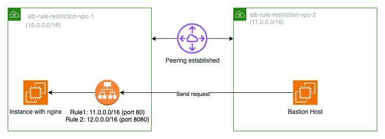

# AWS CDK Stacks

This repository contains stacks for various solutions in AWS. These stacks are used for Proof-of-Concept (POC) and demonstration.

❗ These stacks are not suitable for production.

# Table of Content

- [Initial Setup](#initial-setup)
- [Multi-Architecture Pipeline](#multi-architecture-pipeline)
- [Elastic Container Service (ECS)](#elastic-container-service-ecs)
  - [ECS Cluster Setup](#ecs-cluster-setup)
  - [CICD Pipeline for ECS Cluster](#cicd-pipeline-for-ecs-cluster)
- [Elastic Kubernetes Service (EKS)](#elastic-kubernetes-service-eks)
  - [EKS Cluster Setup](#eks-cluster-setup)
  - [Add-Ons](#add-ons)
  - [Sample Application](#sample-application)
  - [Metrics Server and Horizontal Pod Autoscaler (HPA)](#metrics-server-and-horizontal-pod-autoscaler-hpa)
  - [Argo CD](#argo-cd)
  - [AWS App Mesh](#aws-app-mesh)
  - [Amazon VPC Lattice](#amazon-vpc-lattice)
  - [Distributed ML with Ray](#distributed-ml-with-ray)
- [Egress VPC](#egress-vpc)
- [Application Load Balancer (ALB) Rule Restriction](#application-load-balancer-alb-rule-restriction)

# Initial Setup

1. Install npm packages with `npm install`.

2. Rename 'sample.env' to '.env' and fill up all the values.

3. Configure AWS CLI in order to bootstrap your AWS account for the CDK.

```bash
aws configure set aws_access_key_id {{ACCESS_KEY_ID}}
aws configure set aws_secret_access_key {{SECRET_ACCESS_KEY}}
aws configure set region {{REGION, e.g. ap-southeast-1}}
aws configure set output json
```

4. Bootstrap AWS account for CDK with `cdk bootstrap`.

5. Create an EC2 Key Pair named "EC2DefaultKeyPair".

# Multi-Architecture Pipeline

```bash
cdk deploy mapl
```

The pipeline will build Docker images for x86 and ARM64 architectures and store them in Elastic Container Registry (ECR). A Docker manifest will also be built and uploaded to the registry so that the Docker images for the respective architectures can be retrieved automatically with the 'latest' tag.

# Elastic Container Service (ECS)

## ECS Cluster Setup

> ❗ Prerequisite: Deploy the Multi-Architecture Pipeline using `cdk deploy mapl`.

```bash
cdk deploy ecs
```

Creates a new VPC with a NAT gateway and a new ECS cluster. The ECS cluster has an EC2 Auto-Scaling Group (ASG) as the capacity provider that scales on 70% CPU utilization. An Application Load Balancer (ALB) will be created to expose the ECS service. A similar workload will also be created using Fargate. A CloudWatch dashboard will be created to visualize both workloads (EC2 and Fargate).

## CICD Pipeline for ECS Cluster

> ❗ Prerequisite: Deploy the ECS cluster using `cdk deploy ecs`.

```bash
cdk deploy cicd-ecs
```

Creates a new CodePipeline, ECR repository, and S3 bucket to build and deploy a container image to the ECS cluster created above.

# Elastic Kubernetes Service (EKS)

## EKS Cluster Setup

### 1. Provision an EKS cluster with one of these commands:

```bash
# Deploy a cluster
cdk deploy eks

# Deploy a cluster with Cluster Autoscaler installed
cdk deploy eks-ca
```

These resources will be created:

- A VPC with public and private subnets and a NAT gateway
- An EKS cluster with 1 managed node group (or 2 if Cluster Autoscaler is installed)
- A bastion host to manage the EKS cluster
- The necessary IAM roles and policies

### 2. Access the bastion host

Access the bastion host with 'ec2-user' using SSH or EC2 Instance Connect.

> ❗ The commands listed in the sections under EKS should be executed in the bastion host. Some environment variables (e.g. AWS_REGION, AWS_ACCOUNT_ID, AWS_EKS_CLUSTER) are already populated in the bastion host.

### 3. Configure the AWS CLI and execute a script to setup the bastion host:

```bash
aws configure set aws_access_key_id {{ACCESS_KEY_ID}}
aws configure set aws_secret_access_key {{SECRET_ACCESS_KEY}}

./setup-bastion-host.sh
```

Region is set by 'setup-bastion-host.sh' automatically in the bastion host.

### 4. Test the connectivity to the EKS cluster with any `kubectl` commands.

```bash
kubectl get svc
```

## Add-Ons

1. Download the bash script to install / remove add-ons.

```bash
curl -o eks-add-ons.sh https://raw.githubusercontent.com/tchangkiat/aws-cdk-stacks/main/scripts/EKS/eks-add-ons.sh
chmod +x eks-add-ons.sh
```

2. Install add-ons with `-i` argument or remove add-ons with `-r` argument. Both ID and alias of the add-ons can be used.

Example #1: Install Karpenter

```bash
./eks-add-ons.sh -i karpenter
# OR
./eks-add-ons.sh -i 1
```

Example #2: Install multiple add-ons

```bash
./eks-add-ons.sh -i "karpenter load-balancer-controller"
# OR
./eks-add-ons.sh -i "1 2"
```

Example #3: Remove multiple add-ons

```bash
./eks-add-ons.sh -r "karpenter load-balancer-controller"
# OR
./eks-add-ons.sh -r "1 2"
```

### Supported Add-Ons (alias in brackets)

1. Karpenter ("karpenter")
2. AWS Load Balancer Controller ("load-balancer-controller")
3. AWS EBS CSI Driver ("ebs-csi-driver")
4. Amazon CloudWatch Container Insights ("container-insights")
5. Prometheus and Grafana ("prometheus-grafana")

   - Prerequisite: AWS EBS CSI Driver

6. Ingress NGINX Controller ("ingress-nginx-controller")

   - Also installs cert-manager

7. AWS App Mesh Controller ("app-mesh-controller")
8. AWS Gateway API Controller ("gateway-api-controller")
9. Amazon EMR on EKS ("emr-on-eks")
10. JupyterHub ("jupyterhub")

    - Prerequisites: Karpenter, AWS Load Balancer Controller, and AWS EBS CSI Driver

11. Ray ("ray")

    - Prerequisites: Karpenter

12. Argo CD ("argocd")

    - Prerequisites: Karpenter, AWS Load Balancer Controller

## Sample Application

> ❗ Prerequisite #1: Deploy the Multi-Architecture Pipeline using `cdk deploy mapl`. To use your own container image from a registry, replace \<URL\> and execute `export CONTAINER_IMAGE_URL=<URL>`.

> ❗ Prerequisite #2: Install AWS Load Balancer Controller.

### Setup

1. Deploy the application.

```bash
curl https://raw.githubusercontent.com/tchangkiat/sample-express-api/master/eks/deployment.yaml -o sample-deployment.yaml

sed -i "s|\[URL\]|${CONTAINER_IMAGE_URL}|g" sample-deployment.yaml

kubectl apply -f sample-deployment.yaml
```

### Clean Up

1. Remove the application.

```bash
kubectl delete -f sample-deployment.yaml
```

## Metrics Server and Horizontal Pod Autoscaler (HPA)

### Setup

1. Deploy the Metrics Server:

```bash
kubectl apply -f https://github.com/kubernetes-sigs/metrics-server/releases/latest/download/components.yaml
```

2. The above deployment may take minutes to complete. Check the status with this command:

```bash
kubectl get apiservice v1beta1.metrics.k8s.io -o json | jq '.status'
```

3. Assuming that the sample application was deployed, execute the following command to configure HPA for the deployment:

```bash
kubectl autoscale deployment sample-express-api -n sample \
    --cpu-percent=50 \
    --min=1 \
    --max=10
```

4. Check the details of HPA.

```bash
kubectl get hpa -n sample
```

### Clean Up

1. Remove the HPA and Metrics Server.

```bash
kubectl delete hpa sample-express-api -n sample

kubectl delete -f https://github.com/kubernetes-sigs/metrics-server/releases/latest/download/components.yaml
```

## Argo CD

Credit: [EKS Workshop](https://www.eksworkshop.com/intermediate/290_argocd/)

### Setup

1. Install pre-requisites if they are not installed yet.

```bash
./eks-add-ons.sh -i "karpenter load-balancer-controller"
```

2. Setup Argo CD and install Argo CD CLI.

```bash
./eks-add-ons.sh -i argocd
```

3. Create an application in Argo CD and link it to the repository. Nginx is used as an example below.

```bash
export EKS_CLUSTER_ARN=`kubectl config view -o jsonpath='{.current-context}'`
export ARGOCD_CLUSTER_URL=`argocd cluster list | grep $EKS_CLUSTER_ARN | awk '{print $1}'`
kubectl create namespace nginx
argocd app create nginx --repo https://github.com/tchangkiat/aws-cdk-stacks.git --path assets/argocd --dest-server $ARGOCD_CLUSTER_URL --dest-namespace nginx
```

4. Sync the application in Argo CD to deploy Nginx.

```bash
argocd app sync nginx
```

5. Get the load balancer's CNAME to access Nginx.

```bash
kubectl get svc -n nginx | awk '{print $4}'
```

### Clean Up

1. Remove Nginx application from Argo CD

```bash
argocd app delete nginx -y
kubectl delete ns nginx
```

2. Remove Argo CD.

```bash
./eks-add-ons.sh -r argocd
```

3. Remove pre-requisites.

```bash
./eks-add-ons.sh -r "karpenter load-balancer-controller"
```

## AWS App Mesh

### Setup

1. Install AWS App Mesh Controller with `./eks-add-ons.sh -i app-mesh-controller`

2. The [Sample Application](#sample-application) is used for the following App Mesh setup. Please set it up first before proceeding.

3. Generate the necessary manifest and set up App Mesh.

```bash
curl -o setup-app-mesh.sh https://raw.githubusercontent.com/tchangkiat/aws-cdk-stacks/main/scripts/EKS/setup-app-mesh.sh

chmod +x setup-app-mesh.sh

# Command format is ./setup-app-mesh.sh <application name> <namespace> <container port>
./setup-app-mesh.sh sample-express-api sample 8000
```

4. After App Mesh resources are set up, execute `kubectl rollout restart deployment sample-express-api -n sample` to restart the deployment. Verify if the Envoy proxy container is injected into each Pod of the deployment with `kubectl describe pod <Pod Name> -n sample`.

### [Optional] AWS X-Ray Integration

> ❗ Modify your source code to use the AWS X-Ray SDK. This was already done for the [Sample Application](#sample-application).

1. Update App Mesh Controller to enable X-Ray so that the X-Ray Daemon container will be injected into the Pods automatically

```bash
helm upgrade -i appmesh-controller eks/appmesh-controller --namespace appmesh-system --set region=$AWS_REGION --set serviceAccount.create=false --set serviceAccount.name=appmesh-controller \
    --set tolerations[0].key=CriticalAddonsOnly \
    --set tolerations[0].operator=Exists \
    --set tolerations[0].effect=NoSchedule \
    --set nodeSelector."kubernetes\\.io/arch"=arm64 \
    --set image.repository=public.ecr.aws/appmesh/appmesh-controller \
    --set image.tag=v1.12.3-linux_arm64 \
    --set tracing.enabled=true \
    --set tracing.provider=x-ray
```

2. Execute `kubectl rollout restart deployment sample-express-api -n sample` to restart the deployment. Verify if the X-Ray Daemon container is injected into each Pod of the deployment with `kubectl describe pod <Pod Name> -n sample`.

### Clean Up

1. Remove App Mesh setup of the sample application.

```bash
curl -o remove-app-mesh.sh https://raw.githubusercontent.com/tchangkiat/aws-cdk-stacks/main/scripts/EKS/remove-app-mesh.sh

chmod +x remove-app-mesh.sh

# Command format is ./remove-app-mesh.sh <namespace>
./remove-app-mesh.sh sample-express-api sample
```

2. Remove AWS App Mesh Controller with `./eks-add-ons.sh -r app-mesh-controller`

## Amazon VPC Lattice

> ❗ Prerequisite #1: Deploy the Multi-Architecture Pipeline using `cdk deploy mapl`. To use your own container image from a registry, replace \<URL\> and execute `export CONTAINER_IMAGE_URL=<URL>`.

> ❗ Prerequisite #2: Install [AWS Load Balancer Controller](#aws-load-balancer-controller).

> ❗ Prerequisite #3: Install [Sample Application](#sample-application).

### Setup

1. Install AWS Gateway API Controller with `./eks-add-ons.sh -i gateway-api-controller`

2. Set up Gateway for Sample Application.

```bash
curl -o vpc-lattice-gateway.yaml https://raw.githubusercontent.com/tchangkiat/sample-express-api/master/eks/vpc-lattice/vpc-lattice-gateway.yaml

kubectl apply -f vpc-lattice-gateway.yaml
```

3. Set up HttpRoute for Sample Application.

```bash
curl -o vpc-lattice-httproute.yaml https://raw.githubusercontent.com/tchangkiat/sample-express-api/master/eks/vpc-lattice/vpc-lattice-httproute.yaml

kubectl apply -f vpc-lattice-httproute.yaml
```

### Clean Up

1. Remove HttpRoute for Sample Application.

```bash
kubectl delete -f vpc-lattice-httproute.yaml
```

2. Remove Gateway for Sample Application.

```bash
kubectl delete -f vpc-lattice-gateway.yaml
```

3. Remove AWS Gateway API Controller with `./eks-add-ons.sh -r gateway-api-controller`

## Distributed ML with Ray

### Setup

1. Install the pre-requisites if they are not installed yet.

```bash
./eks-add-ons.sh -i "karpenter load-balancer-controller ebs-csi-driver"
```

2. Install JupyterHub and Ray

```bash
./eks-add-ons.sh -i "jupyterhub ray"
```

3. Use the URL, username and password found in the terminal (example below) to access JupyterHub.

Note: JupyterHub may take a while to start up after installing. During this time, you will notice a blank page and a loading animation in your browser when you access the URL.

```bash
JupyterHub URL: <randomly generated string>.<region>.elb.amazonaws.com
JupyterHub Username: user1 / admin1
JupyterHub Password: <generated password>
```

4. Once you accessed JupyterHub, you can upload and use the example notebook from /assets/ray/xgboost-ray-example.ipynb.

5. On your client machine, run `kubectl port-forward --address 0.0.0.0 svc/raycluster-kuberay-head-svc 8265:8265` in your terminal and use the URL `http://localhost:8265` to access Ray dashboard.

### Cleanup

1. Remove JupyterHub and Ray.

```bash
./eks-add-ons.sh -r "jupyterhub ray"
```

2. Remove pre-requisites.

```bash
./eks-add-ons.sh -r "karpenter load-balancer-controller ebs-csi-driver"
```

# Egress VPC


```bash
cdk deploy egress-vpc
```

Deploy an egress VPC with Transit Gateway. VPN-related resources are deployed for the VPN connection between the Transit Gateway and the simulated customer's on-prem environment. Comment away the code in the section `VPN` of `egress-vpc.ts` if the VPN connection is not required.

## Establish VPN connection from the Transit Gateway to a simulated customer on-prem environment

1. Create 2 secrets in AWS Secrets Manager: `tgw-poc-psk1` and `tgw-poc-psk2`. Plaintext values of the respective secrets should be `{"psk":"tgw.poc.psk1"}` and `{"psk":"tgw.poc.psk2"}`.

2. Un-comment the code in the section `VPN` of `TransitGateway.js`.

3. Follow section 4 and 5 in the following article to deploy an EC2 instance with strongSwan to establish a Site-to-Site VPN -> [Simulating Site-to-Site VPN Customer Gateways Using strongSwan](https://aws.amazon.com/blogs/networking-and-content-delivery/simulating-site-to-site-vpn-customer-gateways-strongswan/).<br/><br/> Below are the values to fill up some of the parameters of the CloudFormation template used in the article above (for the other parameters, follow the instructions in the section 5 of the article):

   - Name of secret in AWS Secrets Manager for VPN Tunnel 1 Pre-Shared Key: `tgw-poc-psk1`
   - Name of secret in AWS Secrets Manager for VPN Tunnel 2 Pre-Shared Key: `tgw-poc-psk2`
   - VPC ID: select `tgw-poc-customer-vpc`
   - VPC CIDR Block: `30.0.0.0/16`
   - Subnet ID for VPN Gateway: select `tgw-poc-customer-vpc/PublicSubnet1`
   - Elastic IP Address Allocation ID: can be found in the output of the CDK stack. The value should start with `eipalloc-`

> ❗ Wait until the VPN Gateway (EC2 Instance) is created and verify that both IPSec tunnels are 'UP' (Site-to-Site VPN Connections > tgw-poc-vpn > Tunnel details), before proceeding to step 4 and 5. This will take a few minutes.

4. Add a route to `20.0.0.0/16` in the route table (Target: Instance > infra-vpngw-test) of `tgw-poc-customer-vpc/PrivateSubnet1` in order to route requests from instances in `tgw-poc-customer-vpc/PrivateSubnet1` to instances in `tgw-poc-vpc-1/PrivateSubnet1`.

5. Create a Transit Gateway Association and Propagation in the Transit Gateway Route Table for the VPN Transit Gateway attachment. Once you completed this step successfully, you should see a route `30.0.0.0/16` propagated in the Transit Gateway Route Table. Note: this step cannot be automated because there is no way to retrieve the VPN Transit Gateway attachment and then create an association and propagation programmatically.

> ❗ The connection between `tgw-poc-vpc-1` and `tgw-poc-customer-vpc` will be established in a few minutes after completing step 5.

## Testing the network connectivity

1. Connect to `tgw-poc-demo-instance` and `tgw-poc-demo-instance-2` using Session Manager

2. Use `ifconfig` in the instances to retrieve the private IP addresses

3. Ping each other using the private IP addresses - e.g. `ping 30.0.1.30` in `tgw-poc-demo-instance`

4. You should receive similar results as those below:

- `tgw-poc-demo-instance`: 64 bytes from 30.0.1.30: icmp_seq=1 ttl=253 time=2.49 ms
- `tgw-poc-demo-instance-2`: 64 bytes from 20.0.0.20: icmp_seq=1 ttl=252 time=3.52 ms

# Application Load Balancer (ALB) Rule Restriction



## Setup

```bash
cdk deploy alb-rule-restriction
```

## Testing the ALB rules

1. Connect to Bastion Host and run the following command. You should receive a response from Nginx.

```bash
curl <ALB DNS Name>:80
```

2. Run the following command. You should receive a response from the ALB: "Denied by ALB".

```bash
curl <ALB DNS Name>:8080
```

## Cleanup

```bash
cdk destroy alb-rule-restriction
```
